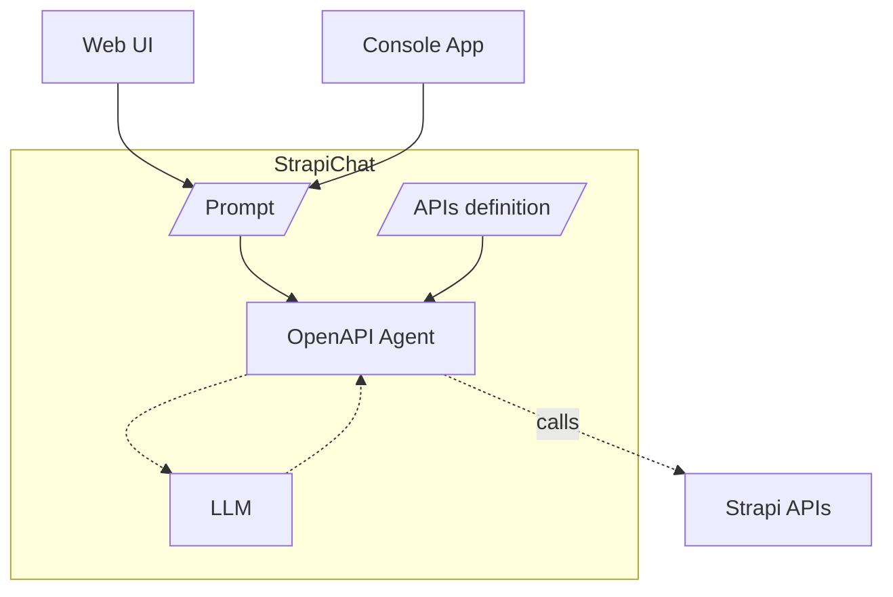
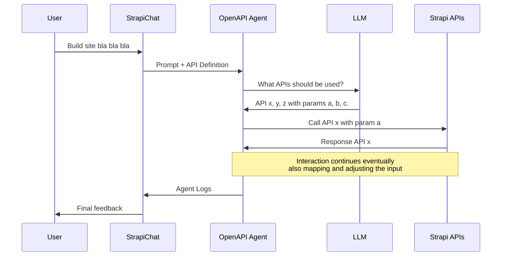
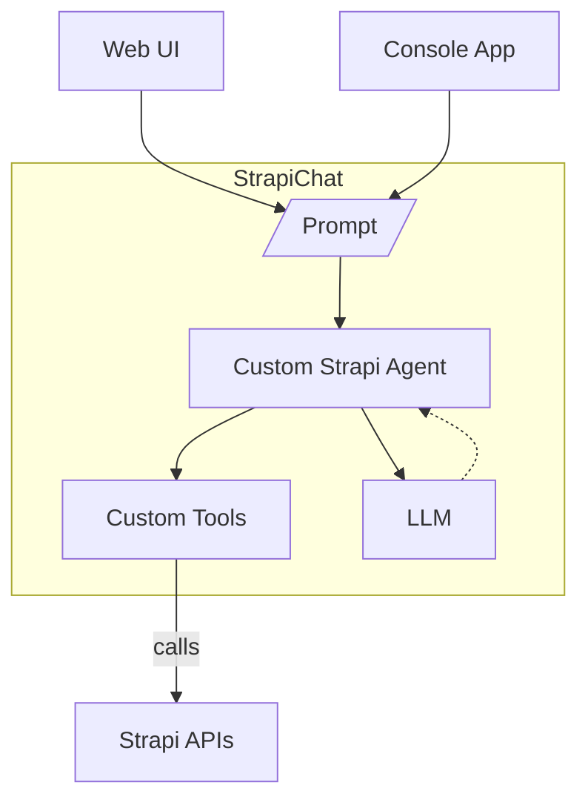
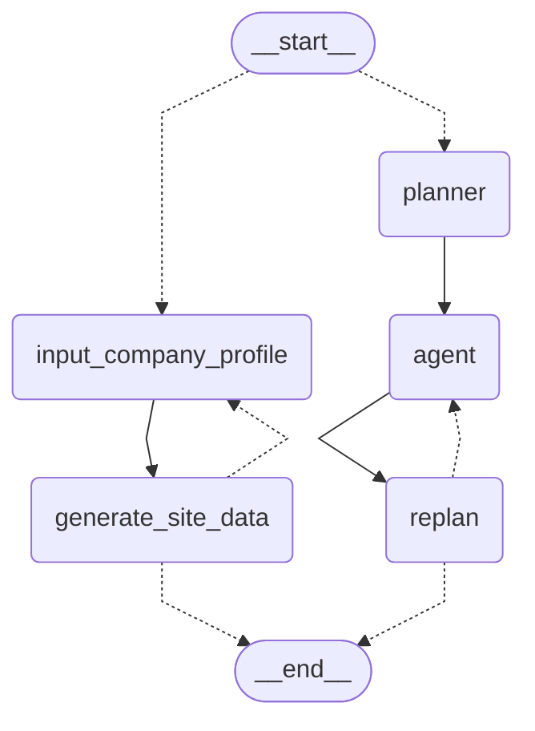

# Strapi Chat

Automate creation of Strapi web sites using a AI agent built on LangGraph, LLM (OpenAI) and custom tools to interact with strapi APIs.

## Context

### Strapi

**Strapi** is an open-source, headless CMS (Content Management System) designed to help developers manage and deliver content via APIs. It offers a customizable backend with support for dynamic content modeling, making it ideal for building flexible and scalable content-driven applications.

### Application Programming Interfaces (APIs)

**APIs** are intermediaries that allow different software applications to communicate with each other. They define rules and protocols for accessing functionality or data, enabling seamless integration between systems, such as retrieving data from a CMS like Strapi or connecting to third-party services.

### Large Language Model (LLM)

**LLM** refers to advanced AI models trained on vast amounts of text data to understand and generate human-like language. These models, such as GPT or T5, leverage billions of parameters to perform tasks like text generation, translation, summarization, and question answering. Their versatility makes them a cornerstone for modern AI applications.

### Retrieval-Augmented Generation (RAG)

Retrieval-Augmented Generation (RAG) is an approach in artificial intelligence that combines a retrieval system with a generative model to generate more accurate, contextually relevant, and knowledge-grounded responses. It is commonly used in applications like question answering, content generation, and conversational AI.

### LangChain, LangGraph, and Agents

**LangChain** is a framework designed to build advanced applications powered by large language models (LLMs). It enables seamless integration of language models with tools, external data, and workflows, making it easier to create context-aware, interactive, and robust AI-driven systems.

**LangGraph** extends LangChain by introducing graph-based workflows, where nodes represent logical steps (e.g., data retrieval, decisions, or tool actions) and edges define the flow of information. This enables modular and transparent AI application development with complex reasoning paths.

**Agents** in LangChain/LangGraph are dynamic systems that use LLMs to decide which actions to take, such as calling tools, querying data sources, or performing computations. They follow structured reasoning steps to handle user inputs interactively and adaptively.
A common agent architecture is the "Reasoning and Acting" (ReAct). This type of agent, is equiped with a set of custom prebuilt tools (function) and can autonomously slelect ehich tool to use to complete the task given in input.
In this project we use an extension of the ReAct agent, namely the "plan and execute" agent, which in adds the capability to build a plan composed by aseries of steps and review the plan at the completion of each step.

## Atchitecture

### ❌ Option 1 - OpenAPI Agent

> ⚠️ **PROPOSAL REJECTED** - See the "Decision" section for more details.



In the diagam above are illustrated the components and the connections of the "Open API Agent" solution. Dashed lines represent fulli automated links of which we have no control. Solid lines represent links in which we cann fully or partially influence.

Using LangChain's OpenAPI agent, we can automate API calls. By crafting the right prompt,
we can guide the agent to execute a specific sequence of calls, detailing the input parameters
for each request and the information to extract from the responses.

The diagram below illustrates a sample RAG flow using the LangChain OpenAPI agent to interact with Strapi APIs.



### ✅ Option 2 - Custom Strapi Agent with LangGraph



In the diagam above are illustrated the components and the connections of the "Custom Strapi Agent" solution. Dashed lines represent fulli automated links of which we have no control. Solid lines represent links in which we cann fully or partially influence.

In this solution, we build a custo agent that has a defined set of pre-coded toolsto interact with the Strapi APIs. The role of the LLM is then to decide which tools to use and what parameters pass in input. To achieve this goal we adopt a ReAct (reasoning and action) approach for our agent. The agent first creates a plan of which tools to use, with a defined sequence, then execute the tool, which connects with the Strapi APIs, and eveluates if to update the plan based on the result of the tool (observation).

### Decison

Based on the table below, the solution selected is: **Option 2: Custom Strapi Agent with LangGraph**

| Feature/Aspect                  | Option 1: OpenAPI Agent                                                                 | Option 2: Custom Strapi Agent with LangGraph                                      |
|---------------------------------|----------------------------------------------------------------------------------------|-----------------------------------------------------------------------------------|
| **🛠️ Use Case Suitability**        | ❌ Suitable for simple API interactions                                                | ✅ Ideal for complex, multi-step interactions requiring custom logic               |
| **📈 Result Consistency**        | ❌ Low, frequent errors in calling APIs or parsing results                              | ✅ High, even with complex workflows                                               |
| **🧩 Implementation Complexity**   | ❌ Lower code complexity but increased prompt complexity                               | ✅ Relatively low code complexity and very low prompt complexity                   |
| **⚠️ Error Handling**              | ❌ Relies on the OpenAPI agent's built-in error handling mechanisms                     | ✅ Customizable error handling tailored to specific needs                          |
| **🚀 Performance**                 | ❌ Frequent errors significantly impact performance                                     | ✅ Can be optimized for specific use cases and performance requirements            |
| **💰 Token Usage**        | ❌ Higher due to API definitions and frequent agent adjustments                        | ✅ Lower as no API definition is loaded and minimal agent adjustments           |

## Implementation of the Custom LangGraph Agent

### Agent Architecture

The Strapi agent, follws a common "plan and execute" agent architecture with additional initial steps required to consisently handle the first user input validation. The  customized agent is built using LangGraph and also paired with a basic Web UI exposed via Flask. The agent is provided with a set of "tools" (functions) which represent basic operations on the Strapi APIs, such as for example adding an image, or creating a page. The tools allows for a customize handling of the Strapi APIs reducing the errors, the token usage and allowing for more precise, consistent and granular interaction with the APIs.

In a normal interaction, the user provides a company profile description and the the agent:

1. Checks if the text in input is good enough and extracts some basic details to set up the design and upload a few AI generated demo images.
2. Uses a preset prompt to create the default web site structure.
3. ✨ Allows for further interactions after the initial creation.  E.g.  the user can tell the agent to add a text or an image into a specific page.



### Agent capabilities

- [x] Internal: Validate company profile context
- [x] Internal: Set up design and site config
- [x] Internal: Generated and uplad AI image
- [x] Tool: Create page
- [x] Tool: Add page to navigation menu
- [x] Tool: Add text component
- [x] Tool: Add image component (using existing image)
- [x] Tool: Add stage component (using existing image)
- [x] Tool: Add footer copyright
- [x] Tool: Add footer link
- [ ] Tool: Add contact form component
- [ ] Tool: Add contact form component


## Getting started

### 1. Set up the environment

To run the demo you first need to make sure to have:

- **Hit The Ccode CMS** - A reachable instance of HTC CMS up and running, including both the **back-end** and the **front-end**.
- **Roles Permissions** - In the Strapi back-end make sure the following permissions are set:
  - `Authenticated`: Full permissions for content, site-config, design, footer, and upload - this should reviewed and fine tuned for production environments.
  - `Public`: Read access content, site-config, design, footer.
- **Python 3.12** - Make sure Python 3.12 is installed in your system. The agent has not been tested with different versions and might not run correctly.

### 2. Dependencies

If needed, create a virtual environmet, activate it, and install the dependencies:

```bash
python -m venv .venv
.venv\Scripts\activate
pip install -r requirements.txt
```

### 2. Environment Variables

If not present yet, create a `.env` file in the project root with the content below. In this file we specify tokens and urls to allow the Strapi agent to acsess a running htc instance and the OpenAI APIs.

> ⚠️ Never commit this file into the source code repository as it contains access tokens!

```bash
OPENAI_API_KEY=<your_openai_api_key>
STRAPI_API_KEY=<your_strapi_api_key>
STRAPI_API_URL=<your_strapi_api_url>
FRONT_END_URL=<your_freont_end_url>
LANGCHAIN_API_KEY=<your_langchain_api_key> #optional
```

### 3. Launch the Web UI

- On **VisualStudio Code**: Go on the*debug* section and select `Web UI` from the list.
- Via console:

  ```bash
  python web_app.py # Web UI
  ```

You can also run the Strapi agent in as console app with, but we do not reccomend this option as it was only ment to be used for the early development.

```bash
python langchain_strapi_assistant.py # Console app - not recommended
```

## Troubleshooting

- **Python Version Compatibility**: Currently, the project has been tested on **Python 3.12**. With other versions it might not work as expected or not run at all.
- **API Key Issues**: If you encounter authorization errors, verify that the `.env` file contains the correct API keys.
- **Cache Issues**: Restart your environment and reload .env variables if necessary.

## Known issues

- In certain conditions, the agent fails to exit the plan after the last step, and keeps looping on that step until, max recursion is reached.
- Stage component creation sometimes fails to link the image - Possibly due to strapi API issue.
- Even tough the agent already supports the interaction and output streaming, the UI doesn't offe this functionality.  The agent

## Suggestions for Future Enhancements

- Persist comapny profile description.
- Multi agent architecture to handle different steps. E.g. initial validation, design set up, website editing.


TO FINISH:

- Contacts - Contact form
- Footer - like example
- Optional - Maps component using use IP


# Mac OS System Setup

## Download Python 3.12
1. Download and install Python 3.12 from [python.org](https://www.python.org).

## Install and Configure pyenv

1. **Install pyenv:**
   ```bash
   brew update
   brew install pyenv
   ```

2. **Add pyenv to your shell configuration file (e.g., `~/.zshrc` for zsh):**
   ```bash
   echo 'export PYENV_ROOT="$HOME/.pyenv"' >> ~/.zshrc
   echo 'export PATH="$PYENV_ROOT/bin:$PATH"' >> ~/.zshrc
   echo 'eval "$(pyenv init --path)"' >> ~/.zshrc
   echo 'eval "$(pyenv init -)"' >> ~/.zshrc
   ```

3. **Restart your terminal or source your configuration file:**
   ```bash
   source ~/.zshrc
   ```

## Install Python 3.12 Using pyenv

1. **Install and set Python 3.12 as global:**
   ```bash
   pyenv install 3.12.0
   pyenv global 3.12.0
   ```

## Set Up Virtual Environment

1. **Create and activate a virtual environment:**
   ```bash
   python3.12 -m venv .venv
   source .venv/bin/activate
   ```

## Install Dependencies

1. **Install required packages:**
   ```bash
   pip install -r requirements.txt
   
   pip install IPython
   pip install --upgrade langchain-openai
   pip install langchain
   pip install langgraph
   pip install langchain_community
   pip install loguru
   pip install agents_deconstructed
   pip install Flask
   pip install flask_socketio
   ```

## Environment Variables

1. **Create a `.env` file in the project root with the following content:**
   ```bash
   OPENAI_API_KEY=<your_openai_api_key>
   STRAPI_API_KEY=<your_strapi_api_key>
   STRAPI_API_URL=http://localhost:1337/api
   FRONT_END_URL=http://localhost:3000
   LANGCHAIN_TRACING_V2=true
   LANGCHAIN_ENDPOINT="https://api.smith.langchain.com"
   LANGCHAIN_API_KEY=<your_langchain_api_key> # optional
   LANGCHAIN_PROJECT="pr-sandy-folklore-53"
   ```

2. **Alternatively, export the environment variables directly in the terminal (.venv):**
   ```bash
   export OPENAI_API_KEY=<your_openai_api_key>
   export STRAPI_API_KEY=<your_strapi_api_key>
   export STRAPI_API_URL=http://localhost:1337/api
   export FRONT_END_URL=http://localhost:3000
   export LANGCHAIN_TRACING_V2=true
   export LANGCHAIN_ENDPOINT="https://api.smith.langchain.com"
   export LANGCHAIN_API_KEY=<your_langchain_api_key> # optional
   export LANGCHAIN_PROJECT="pr-sandy-folklore-53"
   ```

## Launch the Web UI

1. **On Visual Studio Code:**
   - Go to the debug section and select Web UI from the list.

2. **Via console:**
   ```bash
   python web_app.py # Web UI
   ```

3. **Run the Strapi agent as a console app (not recommended):**
   ```bash
   python langchain_strapi_assistant.py # Console app - not recommended
   ```

## Troubleshooting

- **Python Version Compatibility:** Ensure you are using Python 3.12.
- **API Key Issues:** Verify that the `.env` file contains the correct API keys or export them manually as shown above.
- **Cache Issues:** Restart your environment and reload `.env` variables if necessary.

This setup should allow you to run the project on a Mac. If you encounter the unauthorized error, double-check the API keys and ensure they are correct.