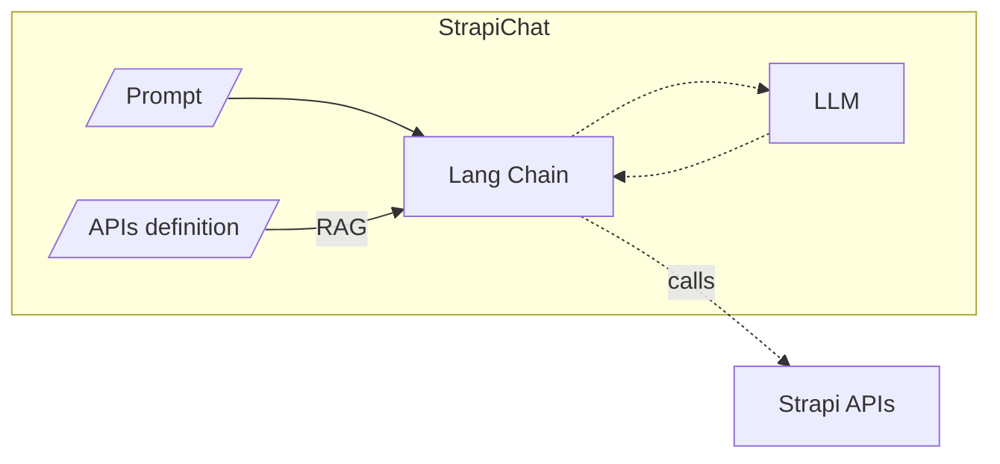

# Strapi Chat

Automate Stripe site creation with LangChain + OpenAPI + LLM.

See [OpenAPI | 🦜️🔗 Langchain](https://python.langchain.com/docs/integrations/toolkits/openapi) for more details on usinig LLMs to interact with OpenAPI APIs.

## Atchitecture

High level architecture of the app.



Sequence diagram 


## Getting started

Install dependencies:

```bash
pip install -r requirements.txt
```