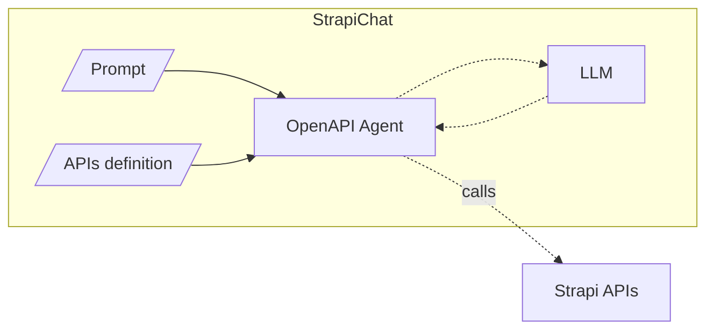
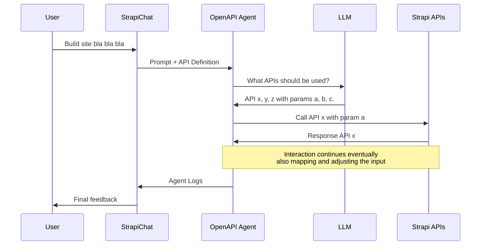
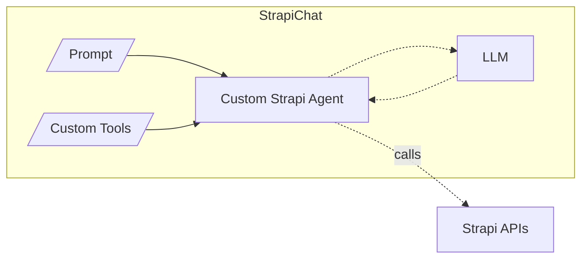
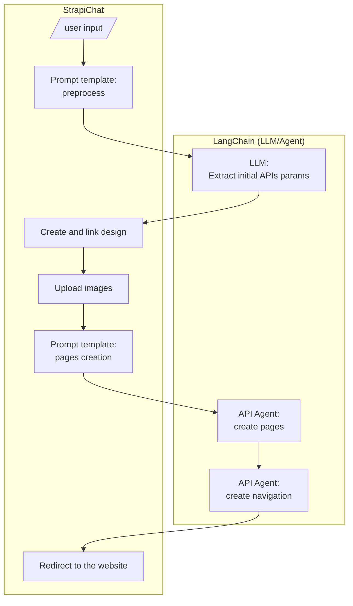

# Strapi Chat

Automate Stripe site creation with LangChain + OpenAPI + LLM.

See [OpenAPI | 🦜️🔗 Langchain](https://python.langchain.com/docs/integrations/toolkits/openapi) for more details on usinig LLMs to interact with OpenAPI APIs.

## Context

### Strapi

**Strapi** is an open-source, headless CMS (Content Management System) designed to help developers manage and deliver content via APIs. It offers a customizable backend with support for dynamic content modeling, making it ideal for building flexible and scalable content-driven applications.

### Application Programming Interfaces (APIs)

**APIs** are intermediaries that allow different software applications to communicate with each other. They define rules and protocols for accessing functionality or data, enabling seamless integration between systems, such as retrieving data from a CMS like Strapi or connecting to third-party services.

### Large Language Model (LLM)

**LLM** refers to advanced AI models trained on vast amounts of text data to understand and generate human-like language. These models, such as GPT or T5, leverage billions of parameters to perform tasks like text generation, translation, summarization, and question answering. Their versatility makes them a cornerstone for modern AI applications.

### Retrieval-Augmented Generation (RAG)

Retrieval-Augmented Generation (RAG) is an approach in artificial intelligence that combines a retrieval system with a generative model to generate more accurate, contextually relevant, and knowledge-grounded responses. It is commonly used in applications like question answering, content generation, and conversational AI.

### LangChain, LangGraph, and Agents

**LangChain** is a framework designed to build advanced applications powered by large language models (LLMs). It enables seamless integration of language models with tools, external data, and workflows, making it easier to create context-aware, interactive, and robust AI-driven systems.

**LangGraph** extends LangChain by introducing graph-based workflows, where nodes represent logical steps (e.g., data retrieval, decisions, or tool actions) and edges define the flow of information. This enables modular and transparent AI application development with complex reasoning paths.

**Agents** in LangChain are dynamic systems that use LLMs to decide which actions to take, such as calling tools, querying data sources, or performing computations. They follow structured reasoning steps (e.g., ReAct) to handle user inputs interactively and adaptively.

## Atchitecture

### ❌ Option 1 - OpenAPI Agent

> ⚠️ **PROPOSAL** - The use of the Retrieval Augmented Generation (RAG) for the API calls instead of manual configuration is not yet confirmed. We need to verify how it handles different cases and if the results are consistent.



Using LangChain's OpenAPI agent, we can automate API calls. By crafting the right prompt,
we can guide the agent to execute a specific sequence of calls, detailing the input parameters
for each request and the information to extract from the responses.

The diagram below illustrates a sample RAG flow using the LangChain OpenAPI agent to interact with Strapi APIs.



### ✅ Option 2 - Custom Strapi Agent with LangGraph

> ⚠️ **PROPOSAL** - In this approach we create a customized agent, which is able to use predefined tools to interact with Strapi APIs.



### Decison

Based on the table below, the solution selected is: **Option 2: Custom Strapi Agent with LangGraph**

| Feature/Aspect                  | Option 1: OpenAPI Agent                                                                 | Option 2: Custom Strapi Agent with LangGraph                                      |
|---------------------------------|----------------------------------------------------------------------------------------|-----------------------------------------------------------------------------------|
| **🛠️ Use Case Suitability**        | ❌ Suitable for simple API interactions                                                | ✅ Ideal for complex, multi-step interactions requiring custom logic               |
| **📈 Result Consistency**        | ❌ Low, frequent errors in calling APIs or parsing results                              | ✅ High, even with complex workflows                                               |
| **🧩 Implementation Complexity**   | ❌ Lower code complexity but increased prompt complexity                               | ✅ Relatively low code complexity and very low prompt complexity                   |
| **⚠️ Error Handling**              | ❌ Relies on the OpenAPI agent's built-in error handling mechanisms                     | ✅ Customizable error handling tailored to specific needs                          |
| **🚀 Performance**                 | ❌ Frequent errors significantly impact performance                                     | ✅ Can be optimized for specific use cases and performance requirements            |
| **💰 Token Usage**        | ❌ Higher due to API definitions and frequent agent adjustments                        | ✅ Lower as no API definition is loaded and minimal agent adjustments           |

## Processing Flow



## Custom LangGraph agent

Tools:

- [x] Set up theme (theme, 5 images)
- [ ] Navigation
- [x] Create page
- [x] Add text component
- [x] Add image component (using existing image)
- [x] Add stage component (using existing image)
- [ ] Delete page

Enhancements:

- Multi agent to handle the first validation and design set up
- Persist comapny profile description

## Getting started

The strapi Chat needs acsess to a running htc instance, and we need to create and connect our acsess token to Strapi:

If needed, create a virtual environmet, activate it, and install the dependencies:

```bash
python -m venv .venv
.venv\Scripts\activate
pip install -r requirements.txt
```

Run the app:

```bash
python langchain_strapi_assistant.py
```


## Environment Setup

This project uses environment variables for configuration. Create a `.env` file in the project root with the following content:

```bash
STRAPI_API_KEY=<your_strapi_api_key>
OPENAI_API_KEY=<your_openai_api_key>
```

## Troubleshooting

- **Version Compatibility**: Ensure that 
- **API Key Issues**: If you encounter authorization errors, verify that the `.env` file contains the correct API keys.
- **Cache Issues**:restart your environment and reload .env variables if necessary.