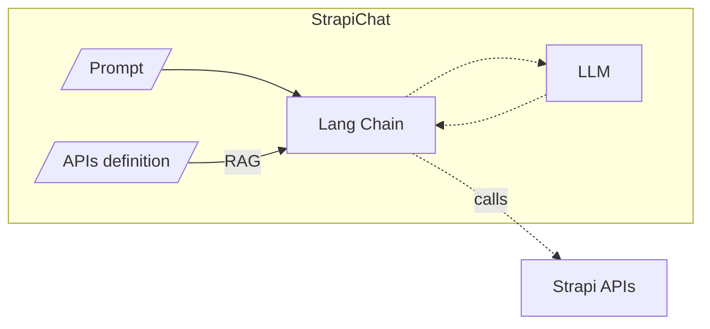
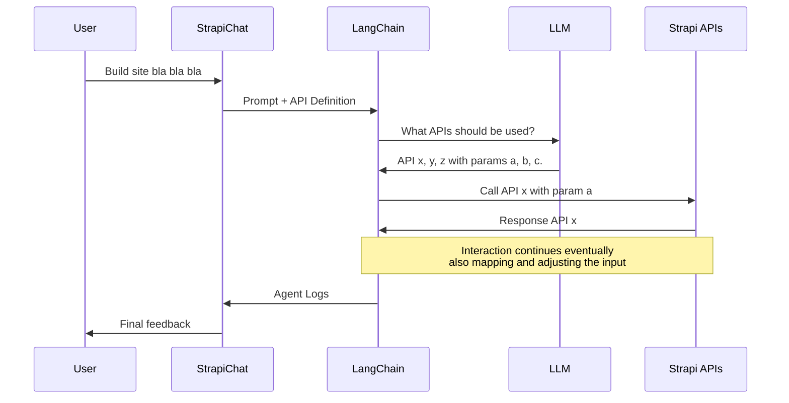
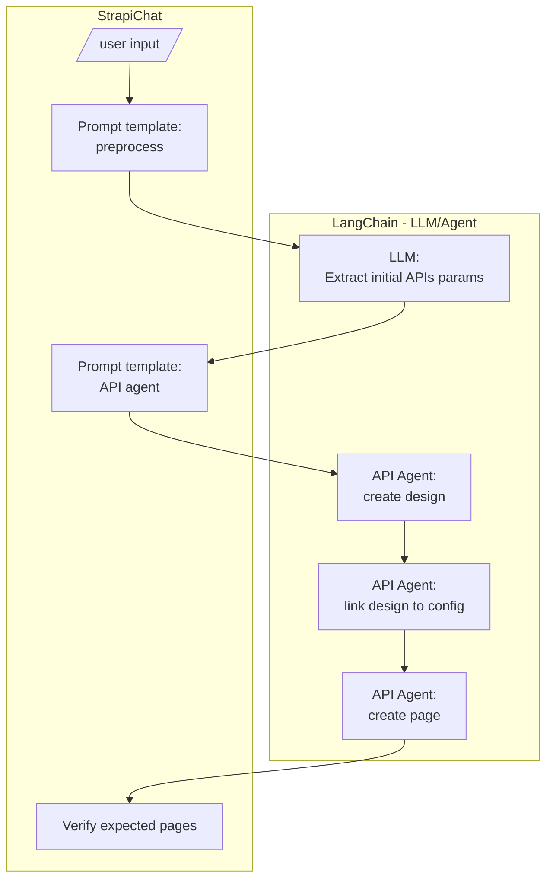

# Strapi Chat

Automate Stripe site creation with LangChain + OpenAPI + LLM.

See [OpenAPI | 🦜️🔗 Langchain](https://python.langchain.com/docs/integrations/toolkits/openapi) for more details on usinig LLMs to interact with OpenAPI APIs.

## Atchitecture

### Components



### Retrieval Augmented Generation (RAG)

> ⚠️ **PROPOSAL** - The use of the RAG for the API calls instead of manual configuration is 
> not yet confirmed. We need to verify how it handles different cases and if the results are consistent.

Using LangChain's OpenAPI agent, we can automate API calls. By crafting the right prompt,
we can guide the agent to execute a specific sequence of calls, detailing the input parameters
for each request and the information to extract from the responses.

The diagram below illustrates a sample RAG flow using the LangChain OpenAPI agent to interact with Strapi APIs.



## Processing Flow




## Getting started

Install dependencies:

```bash
pip install -r requirements.txt
```

