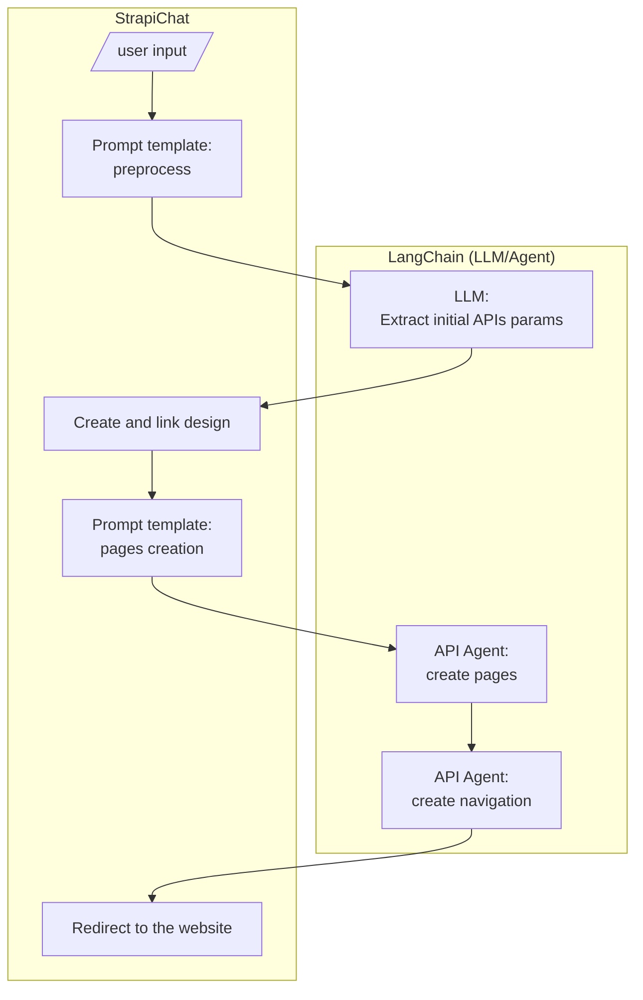

# Strapi Chat

Automate Stripe site creation with LangChain + OpenAPI + LLM.

See [OpenAPI | 🦜️🔗 Langchain](https://python.langchain.com/docs/integrations/toolkits/openapi) for more details on usinig LLMs to interact with OpenAPI APIs.

## Atchitecture

### Components


### Retrieval Augmented Generation (RAG)

> ⚠️ **PROPOSAL** - The use of the RAG for the API calls instead of manual configuration is 
> not yet confirmed. We need to verify how it handles different cases and if the results are consistent.

Using LangChain's OpenAPI agent, we can automate API calls. By crafting the right prompt,
we can guide the agent to execute a specific sequence of calls, detailing the input parameters
for each request and the information to extract from the responses.

The diagram below illustrates a sample RAG flow using the LangChain OpenAPI agent to interact with Strapi APIs.


## Processing Flow



## Getting started

The strapi Chat needs acsess to a running htc instance, and we need to create and connect our acsess token to Strapi:

If needed, create a virtual environmet, activate it, and install the dependencies:

```bash
python -m venv .venv
.venv\Scripts\activate
pip install -r requirements.txt
```

Run the app:

```bash
python langchain_strapi_assistant.py
```


## Environment Setup

This project uses environment variables for configuration. Create a `.env` file in the project root with the following content:

```bash
STRAPI_API_KEY=<your_strapi_api_key>
OPENAI_API_KEY=<your_openai_api_key>
```

## Troubleshooting

- **Version Compatibility**: Ensure that 
- **API Key Issues**: If you encounter authorization errors, verify that the `.env` file contains the correct API keys.
- **Cache Issues**:restart your environment and reload .env variables if necessary.